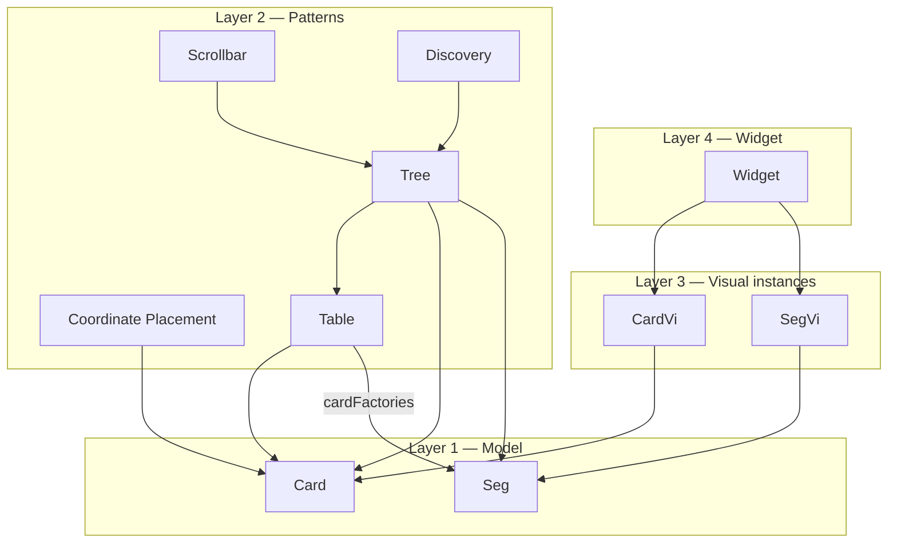
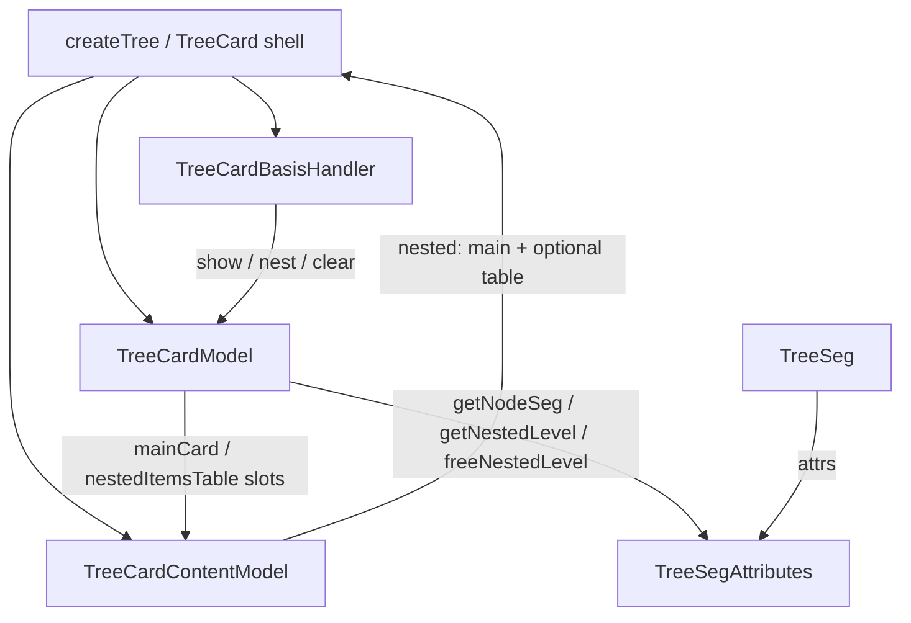
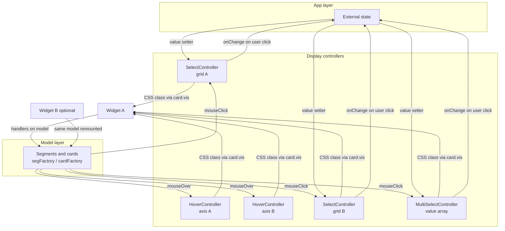
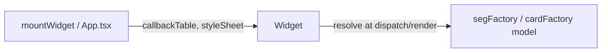

# xorlab2

XorLAB Project

## Development state

Development is **in progress**

## Why XorLAB

XorLAB builds multi-axis grids whose **layout structure reflects relations among your business objects**, rather than a flat table with a separate column schema.

Traditional tables (and libraries layered on them) describe columns or independent cells. XorLAB describes **segments and cards**:

- **Segments** may be mounted on the vertical or horizontal axis; the segment model itself is axis-invariant. Segments are not displayed for the user; they own coordinates and sizes of cards lying in them.
- **Cards** dock into those segments. Cards are what the user sees; their position and size come from the segments they sit on.

That model gives you:

1. **Nested geometry** — Both segments and cards can form trees, not only flat lists.
2. **Structure follows the domain** — Widget geometry tracks object relations, not a separate column schema.
3. **Strong typing** — The preprocessor generates typed segment and card identities (`GenSegments` / `GenCards`); see [Factory API](#factory-api).
4. This widget scales better as complexity grows. For example, when we add more dimensions or more nested layers.
5. **Independent regions** — Scroll or collapse/expand widget regions separately.
6. **Reuse without remodeling** — Mount the same card/segment model in different slots (rows vs columns, alternate composite frames) via [Layer Anchor](#layer-anchor-pattern), [Template](#template-pattern), and [Table](#table-pattern) — swap placement, keep the model.
7. **Region-scoped interaction** — Separate [HoverController](#hovercontroller), [SelectController](#selectcontroller), and [DragController](#dragcontroller) instances per region (`xorlab-interactive`), without baking interaction into the grid schema.
8. **Linear-algebra overlays** — Sum along an axis, matrix product, and elementwise product via `xorlab-linalg` (`sumUpCardFactory`, `matrixProductCardFactory`, …).


## How to Use XorLAB

1. Add `xorlab` as a dependency and `preprocessor-library` as a devDependency (the latter provides the `xorlab-preprocessor` CLI). Optionally add `xorlab-interactive`, `xorlab-linalg`, or `xorlab-discover` as needed.
2. Configure `tsconfig` so TypeScript picks up generated types:

```jsonc
{
  "compilerOptions": {
    // ...
    "baseUrl": ".",
    "paths": {
      "generated/*": ["generated/*"]
    }
  },
  "include": ["src", "generated"]
}
```

3. From the app root, run the preprocessor to generate strongly typed schema (`generated/generated-cards.d.ts` and `generated/generated-lines.d.ts`):

```shellscript
npx xorlab-preprocessor
```

Or add a script such as `"preprocess": "xorlab-preprocessor"` and run `npm run preprocess`.

4. Import factories from `"xorlab"`. Use `GenCardTypes` / `GenSegTypes` as globals — do not import from `generated/`. See [Factory API](#factory-api).

5. Re-run the preprocessor after adding or renaming string-literal `typeName`s on `segFactory` / `cardFactory`, then build and run as usual.


## Architecture / dependency layering

Four layers. Dependencies point toward lower layers. Patterns compose Seg/Card; SegVi/CardVi mirror Seg/Card only (no pattern knowledge); Widget owns the Vi trees.




- **Layer 1 — Seg / Card** — Domain geometry model. [Coordinate Placement](#coordinate-placement-pattern) is expressed on Card (`selfPos` / default stretch). Seg’s `cardFactories` is the [Table Pattern](#table-pattern) shortcut only — not Tree, Scrollbar, or Discovery.
- **Layer 2 — Patterns** — Compose Seg and Card. [Tree](#tree-pattern) uses Seg, Card, and Table; it does not own Scrollbar or Discovery. **Scrollbar** and **Discovery** (`[xorlab-discover](xorlab-discover/README.md)`) use Tree (`createTree`, `TreeSeg`).
- **Layer 3 — SegVi / CardVi** — Mirror Seg / Card structure and geometry only. No Table, Tree, Scrollbar, or Discovery knowledge. Generic renderer hooks (for example `omitDomUntilPainted`) are allowed; pattern names are not. See [CardVi and SegVi](#cardvi-and-segvi).
- **Layer 4 — Widget** — `[Widget](xorlab/src/renderer/Widget.ts)` owns Vi trees (create, rebind, collapse/expand, destroy); mounts horizontal/vertical SegVi and the root CardVi.


## Factory API

Xorlab exposes typed factories from the `xorlab` package. Use these in application and example code — not the internal basic-layer constructors.


| Construct | Public API    | Internal implementation (do not import)                                          |
| --------- | ------------- | -------------------------------------------------------------------------------- |
| Segment   | `segFactory`  | `createSeg` in `[xorlab/src/basic/Seg.ts](xorlab/src/basic/Seg.ts)`              |
| Card      | `cardFactory` | `createCard` in `[xorlab/src/basic/card/Card.ts](xorlab/src/basic/card/Card.ts)` |


Internal constructors are exported from `xorlab/src/basic/*` for framework wiring but are not part of the `xorlab` package public surface. Always import factories from `"xorlab"`.

**Type generation.** The preprocessor scans `segFactory` and `cardFactory` calls in your project and writes `generated/generated-lines.d.ts` (`GenSegments`) and `generated/generated-cards.d.ts` (`GenCards`). Always pass a string literal `typeName` so types are inferred.

Use generated types directly as the source of truth:

- card types: `GenCardTypes.<TypeName>`
- segment types: `GenSegTypes.<TypeName>`

Avoid manual aliases like `type LessonCard = ReturnType<typeof lessonCardFactory>` when `GenCardTypes.LessonCard` (or `GenSegTypes.*`) is already available. See [Named layout types](#named-layout-types).

### Infer factory returns

Do **not** annotate helpers that return `cardFactory` / `segFactory` results as `ICard` or `ISeg`. That widens the return and drops generated card/segment types. Prefer inferred returns; when a named type is needed, use `GenCardTypes.<TypeName>` / `GenSegTypes.<TypeName>`.

Incorrect:

```typescript
export function createRequestedMatrixCard(entries: RequestedEntry[]): ICard {
  return cardFactory({ typeName: "RequestedListCard", /* ... */ });
}
```

Correct:

```typescript
export function createRequestedMatrixCard(entries: RequestedEntry[]) {
  return cardFactory({ typeName: "RequestedListCard", /* ... */ });
}
```


### Named layout types

Do **not** type cards, segments, or layout/model objects as `ReturnType<typeof someFactory>`. Write an explicit interface and annotate the function. `GenCardTypes` / `GenSegTypes` are globals from preprocessor `generated/*.d.ts` — no import.

Incorrect:

```typescript
export function createMonthlyGridLayout(year: number = MONTHLY_GRID_YEAR) {
    return { widgetCard: yearCardFactory(year), /* ... */ };
}

export type MonthlyGridLayout = ReturnType<typeof createMonthlyGridLayout>;
```

Correct:

```typescript
export interface MonthlyGridLayout {
    widgetCard: GenCardTypes.YearCard;
    daySelect: SelectController<string>;
    verticalContentSeg: GenSegTypes.MonthRowListSeg;
    horizontalContentSeg: GenSegTypes.MonthColListSeg;
}

export function createMonthlyGridLayout(
    year: number = MONTHLY_GRID_YEAR,
): MonthlyGridLayout {
    return { widgetCard: yearCardFactory(year), /* ... */ };
}
```

Single `cardFactory` / `segFactory` helpers may still infer their return; see [Infer factory returns](#infer-factory-returns).

**Callback typing.** Do not annotate `selfPos`, `cardFactories`, or `EReadCollection` callback parameters with `any`. See [Callback Typing Convention](#callback-typing-convention).

**Naming.** Segment and card `typeName` values follow [Naming Conventions](#naming-conventions): `GroupSeg`, `GroupListSeg`, `ElementCard`, …

Correct:

```typescript
import { segFactory, cardFactory, eArrayFactory, eMappedFactory } from "xorlab";

export const groupSegFactory = (group: Group) =>
  segFactory({ typeName: "GroupSeg", attrs: group });

export const groupListSeg = segFactory({
  typeName: "GroupListSeg",
  nested: eMappedFactory(groups, groupSegFactory),
});
```

Incorrect — do not import basic-layer constructors in application code:

```typescript
import { createSeg } from "xorlab/src/basic/Seg"; // use segFactory from "xorlab"
import { createCard } from "xorlab/src/basic/card/Card"; // use cardFactory from "xorlab"
```

Facade reference: `[xorlab/src/facade/line.ts](xorlab/src/facade/line.ts)` (`segFactory`, `ISeg`), `[xorlab/src/facade/card.ts](xorlab/src/facade/card.ts)` (`cardFactory`, `ICard`).

## Naming Conventions

Use explicit names for single items and list containers in segments and cards.

- Use `*Seg` for a single segment item, for example `GroupSeg` or `PeriodSeg`.
- Use `*ListSeg` for a segment that contains nested items, for example `GroupListSeg` or `PeriodListSeg`.
- Use `*Card` for a single card item, for example `ElementCard`.
- Use `*ListCard` for a card that contains nested items, for example `ElementListCard`.

You may deviate when the parent is not a generic list of the same item type but a different concept that nests children. For example, `WeekSeg` may contain nested `DaySeg` segments without using `WeekListSeg`.

### Type name uniqueness

Segment and card `typeName` values must be **globally unique** within a preprocessed project. The xorlab preprocessor rejects a name used as both a segment and a card.

You may call `segFactory` or `cardFactory` multiple times with the same `typeName` when the `attrs` and `nested` types match. Other factory props (`mouseOver`, `mouseClick`, `mouseDoubleClick`, `style`, `selfPos`, `cardFactories`, …) may differ between those calls.

Preprocessor-generated `GenEntities` is the union of `GenSegments` and `GenCards` and is the key namespace for Widget `callbackTable` entries.

## Callback Typing Convention

Do **not** annotate callback parameters with `any` in these three zones. Using `any` here is bad practice — it disables inference from preprocessor-generated types and hides real type errors. The only acceptable alternatives are **implicit typing** (preferred) or **explicit correct types** from generated `GenSegments` / `GenCards` (for example `PeriodSeg`, or `ISeg & { attrs: PeriodEntry }` when inference is unavailable).


| Zone                     | Where                                                                                   | Preferred approach                                                                                               |
| ------------------------ | --------------------------------------------------------------------------------------- | ---------------------------------------------------------------------------------------------------------------- |
| `selfPos` handlers       | `CardProps.selfPos`, `tableFactory` / `createTree` selfPos                              | Inline handlers inside `cardFactory` or the factory call; let `GenSegments` infer `place` and `self`            |
| `cardFactories` handlers | `SegProps.cardFactories`                                                                | Inline inside `segFactory`; let `GenOrthoCardFactories` infer `ortho` and `self`                                |
| `callbackTable` handlers | `Widget({ callbackTable })`                                                             | Define at mount time in view code; keys are `typeName` values from `GenEntities`                                |
| Collection callbacks     | `EReadCollection.find` / `forEach` / `map` / `findIndex` (and `ECollection` extensions) | Omit param types when the collection item type is known; or use explicit segment/card types from generated files |


Keep `selfPos` and `cardFactories` handlers inline. Do not extract them into helper functions typed as `any`.

### Why `any` breaks typing

- `createSelfPos` **returning** `: any` — When `selfPos` is extracted into a helper typed as `any`, TypeScript cannot infer `CardProps.selfPos` from the inline `cardFactory` call. The preprocessor-linked types for `place` and `self` are lost, and strongly-typed `selfPos` is not generated for the card.
- `PeriodListSeg: (place: any) => ...` — Annotating `place` as `any` rejects the strongly-typed place segment that the key (`PeriodListSeg`) and generated `GenSegments` types would otherwise provide.
- `find` **callback** `: any` — Same problem for collection item types; see the table above.


### Parameter naming

Use consistent names so handlers read the same across the codebase:


| Callback        | 1st arg | Meaning                                      | 2nd arg | Meaning                        |
| --------------- | ------- | -------------------------------------------- | ------- | ------------------------------ |
| `selfPos`       | `place` | Segment the card is positioned along         | `self`  | The card itself                |
| `cardFactories` | `ortho` | Orthogonal segment the generated card is for | `self`  | The segment owning the factory |


Omit unused parameters with `_`. When only one argument is used, still name it according to its position (`place`, `ortho`, or `self`).

### selfPos — incorrect

```typescript
export function createElementListCard(elements: ChemicalElement[]) {
  const elementCollection = eArrayFactory<ChemicalElement[]>(elements);
  const createSelfPos = (element: ChemicalElement): any => ({
    PeriodListSeg: (place) =>
      place.nested.find(
        (periodSeg: any) => periodSeg.attrs.period === element.period
      ),
    GroupListSeg: (place) =>
      place.nested.find(
        (groupSeg: any) => groupSeg.attrs.group === element.group
      ),
  });

  return cardFactory({
    typeName: "ElementListCard",
    nested: eMappedFactory(elementCollection, (element) =>
      cardFactory({
        typeName: "ElementCard",
        attrs: element,
        selfPos: createSelfPos(element),
      })
    ),
  });
}
```

Also bad: `PeriodListSeg: (place: any) => ...` — the same problem applies to the `place` parameter.

### selfPos — correct

```typescript
export function createElementListCard(elements: ChemicalElement[]) {
  const elementCollection = eArrayFactory<ChemicalElement[]>(elements);

  return cardFactory({
    typeName: "ElementListCard",
    nested: eMappedFactory(elementCollection, (element) =>
      cardFactory({
        typeName: "ElementCard",
        attrs: element,
        selfPos: {
          PeriodListSeg: (place) =>
            place.nested.find(
              (periodSeg) => periodSeg.attrs.period === element.period
            ),
          GroupListSeg: (place) =>
            place.nested.find(
              (groupSeg) => groupSeg.attrs.group === element.group
            ),
        },
      })
    ),
  });
}
```

This allows TypeScript to infer correct types for `place`, `periodSeg`, and `groupSeg`. The inline `selfPos` handlers in the correct example also illustrate the [Coordinate Placement Pattern](#coordinate-placement-pattern).

### selfPos scope — no axis conditionals

List `selfPos` handlers for every coordinate (place segment type) the card may need. XorLAB calls only the handler whose key matches `place.typeName` along the card's actual placement path — extra keys are inert, not harmful. A parent [Layer Anchor](#layer-anchor-pattern) still scopes which axes apply at runtime (for example `GroupTimetableCard` pins `GroupListSeg`, so a child never traverses `TeacherListSeg` even if that handler is defined).

**Incorrect** — branching `selfPos` (or `cardFactories`) on placement axis:

```typescript
// Bad: conditional keys in selfPos
selfPos: {
  WeekSeg: (place) => /* ... */,
  WeekdaySeg: (place) => /* ... */,
  ...(slot.axis === "group"
    ? { GroupListSeg: (place) => /* ... */ }
    : { TeacherListSeg: (place) => /* ... */ }),
}
```

**Correct** — handlers for every coordinate; XorLAB uses only those on the actual placement path:

```typescript
// Good: position along all coordinates; XorLAB uses only the places the card is put into
selfPos: {
  WeekSeg: (place) => /* ... */,
  WeekdaySeg: (place) => /* ... */,
  GroupListSeg: (place) => /* ... */,
  TeacherListSeg: (place) => /* ... */,
}
```

See `[examples/timetable/src/domain/Lesson.ts](examples/timetable/src/domain/Lesson.ts)`. The timetable example uses one `lessonCardFactory` / `lessonListCardFactory` with full `selfPos` handlers; layer anchors choose which row axis applies. The same rule applies to `cardFactories` when a table's `mainLine` / `orthoLine` already fixes which ortho segments apply.

### cardFactories — incorrect

```typescript
segFactory({
  typeName: "GroupSeg",
  attrs: groupEntry,
  cardFactories: {
    LabelPlaceSeg: (_: any, self: any) =>
      cardFactory({
        typeName: "GroupHeaderCard",
        renderer: textRendererFactory(() => String(self.attrs.group)),
      }),
  },
});
```


### cardFactories — correct

```typescript
segFactory({
  typeName: "GroupSeg",
  attrs: groupEntry,
  cardFactories: {
    LabelPlaceSeg: (_, self) =>
      cardFactory({
        typeName: "GroupHeaderCard",
        renderer: textRendererFactory(() => String(self.attrs.group)),
      }),
  },
});
```


### Avoid unnecessary type casts

Prefer aligning types at factory boundaries so `selfPos`, `childPos`, and `cardFactories` pass through without `as unknown as`. Spurious casts hide real mismatches and defeat the typing rules above; use them only where variance or framework-only keys genuinely require a bridge.

Legitimate remaining casts inside xorlab:

- Return-type branding after preprocessor inference (`CardAdapter`, `SegAdapter`)
- Handler variance for `mouseOver` / `mouseClick` / `mouseDoubleClick` when facade `CardSelf` / `SegOrthoSelf` differs from runtime `ICard` / `ISeg`
- Framework-only segment keys (for example `ScrollableVerticalSeg`) not present in `GenSegments` until preprocess runs
- Test mocks and collection implementation bridges in `facadeFactories.ts`


## Layout Patterns

Cards attach to the segment tree via `selfPos`: a map from segment type name to `(place, self) => target segment`. The patterns below are reusable recipes; real widgets often combine them. The timetable and calendar examples combine the **Template pattern** (empty slots filled by setup) with the others.

### Coordinate Placement Pattern

A list card holds many item cards. Each item card carries domain attrs and uses `selfPos` handlers to walk the parent segment tree and land in the correct card — often across two or more segment types (row axis + column axis, or list + grid).

Handlers are keyed by segment type name (`WeekSeg`, `TeacherListSeg`, …). Resolution uses `place.nested.find(...)` (or chained `.find`) comparing `seg.attrs` to `self.attrs` or closure data. Children are declared explicitly (`eMappedFactory`), not generated from a main line segment.

Examples:

- `[examples/timetable/src/domain/Lesson.ts](examples/timetable/src/domain/Lesson.ts)` — `LessonCard` places by weekday, hour, teacher, and group
- `[examples/periodic-table/src/domain/elements.ts](examples/periodic-table/src/domain/elements.ts)` — `ElementCard` places by period and group (see also the correct example above)

```typescript
selfPos: {
  WeekSeg: (place, self) =>
    place.nested
      .find((seg) => seg.attrs.weekday.order === lesson.weekday)
      ?.nested?.find((seg) => seg.attrs.hour === lesson.hour),
  TeacherListSeg: (place, self) =>
    place.nested.find((seg) => self.attrs.teacherId === lesson.teacherId),
  GroupListSeg: (place, self) =>
    place.nested.find((seg) => self.attrs.groupId === lesson.groupId),
},
```


### Table Pattern

`tableFactory({ mainLine, orthoLine })` builds a 2D grid card. At `setBasis`, it requires exactly one segment of each type, replaces its nested collection with `mainSeg.nested`, and maps each main-line child through an ortho factory (default: `item.cardFactories[orthoLine](ortho, item)`).

- **Main line** — row source (`TeacherListSeg`, `WeekSeg`, `PeriodSeg`, …)
- **Ortho line** — column or header segment (`TeacherColumnsSeg`, `TimePlaceSeg`, `WeekSeg`, …)
- Row segments declare `cardFactories.<orthoLine>` or use `self.extrude(ortho)` / `ortho.extrude(self)` (`[xorlab/src/facade/line.ts](xorlab/src/facade/line.ts)` — `ISeg.extrude`)
- Table card `selfPos` anchors the whole grid to both axes in the composite layout

Examples:

- `[examples/timetable/src/domain/Teacher.ts](examples/timetable/src/domain/Teacher.ts)` — `teacherListCardFactory`
- `[examples/timetable/src/domain/Time.ts](examples/timetable/src/domain/Time.ts)` — `timeHeaderCardFactory` (nested tables via `extrude`)
- `[examples/calendar/src/domain2/calendar.ts](examples/calendar/src/domain2/calendar.ts)` — multiple table cards over the same geometry

Implementation: `[xorlab/src/basic/table/Table.ts](xorlab/src/basic/table/Table.ts)`, `[xorlab/src/facade/table.ts](xorlab/src/facade/table.ts)`.

```typescript
tableFactory({
  mainLine: "TeacherListSeg",
  orthoLine: "TeacherColumnsSeg",
  selfPos: {
    TimetableHorizontalSeg: (place) => place.nested.getItemByType("TeacherColumnsSeg"),
    TimetableVerticalSeg: (place) => place.nested.getItemByType("TeacherListSeg"),
  },
});
```


### Template Pattern

A **template** is any fixed system of cards and segments where some positions are intentionally left empty — placeholder slots in the skeleton. A **setup** is the code that fills those empty slots with domain-specific cards and segments. `selfPos` connects the filled cards to the correct place in the template structure.

**Example: two-axis scroll widget.** `scrollableSystemFactory({ verticalContentSeg, horizontalContentSeg, widgetCard })` applies the Template Pattern to a scrollable widget:

- **Template defines** — scrollable host segments (`ScrollableVerticalSeg`, `ScrollableHorizontalSeg`), `TreeSeg` with empty `ScrollbarPlaceSeg` placeholders, composite `ScrollableCard`, and scrollbar tree cards
- **Setup fills** — vertical content segment, horizontal content segment, and widget card (e.g. `timetableScrollableSystemFactory`, `calendarScrollableSystemFactory` return `{ vertical, horizontal, card }` for `Widget`)
- Content segments should use `100flex` window sizing so content and scrollbar lane share the host
- Inner domain cards keep `selfPos` keyed by content segment type names; only the outer widget wrapper uses scrollable host names

Scrollbar slot filling on a single axis is the [Tree Pattern](#tree-pattern) special case.

Examples:

- `[examples/timetable/src/view/TimetableCompositeView.ts](examples/timetable/src/view/TimetableCompositeView.ts)` — `timetableScrollableSystemFactory`
- `[examples/calendar/src/view/CalendarCompositeView.ts](examples/calendar/src/view/CalendarCompositeView.ts)` — `calendarScrollableSystemFactory`

Implementation: `[xorlab/src/facade/scrollable.ts](xorlab/src/facade/scrollable.ts)`, `[xorlab/src/basic/scroll/ScrollableSystem.ts](xorlab/src/basic/scroll/ScrollableSystem.ts)`.

```typescript
// Content segments passed into scrollableSystemFactory are built with segFactory:
const verticalContentSeg = segFactory({
  typeName: "TimetableVerticalSeg",
  nested: distinctTypeLineCollectionFactory([...]),
  style: { window: "100flex" },
});

const { vertical, horizontal, card } = scrollableSystemFactory({
  verticalContentSeg,
  horizontalContentSeg: timetableHorizontalSegFactory(),
  widgetCard: timetableWidgetCardFactory(),
});

new Widget({ vertical, horizontal, card, ... });
```


### Tree Pattern

Tree wiring is a [Template Pattern](#template-pattern) special case: one content segment paired with one `TreeSeg` that exposes **empty node segments** (e.g. `ScrollbarPlaceSeg`) for cards to occupy. A tree card (`createTree` / `scrollableSystemFactory`) does not own scroll geometry directly; it requests slots from `TreeSeg`:

- `getNodeSeg()` — node placeholder on the current TreeSeg level
- `getNestedLevel()` — inner `TreeSeg` for the next recursion level




**TreeCard** (`createTree`) is the `ICard` shell: `nested` is `content.nested`, and basis changes go through `TreeCardBasisHandler`. **TreeCardModel** owns layout **policy** — when to show the main card, seed the child table, deepen vs stay on the host, and release inner levels — and talks to `TreeSegAttributes`; it does not hold the nested list. **TreeCardContentModel** owns layout **storage** — the `nested` `EArray`, Property-backed main-card and nested-items-table slots that sync into `nested`, plus error/squared placeholders. **TreeSeg** / **TreeSegAttributes** are the axis API: `getNodeSeg()`, `getNestedLevel()`, `freeNestedLevel()`, `getHostTreeSeg()`.

**When the main card appears.** `createTree({ renderCondition })` shows the main card when `renderCondition(place)` is true. That predicate is also `placeActive` for nesting/deepen. Callers choose the predicate — TreeCardModel does not know about scrollbars or discovery:

- Scrollbars: `window > 0 && window < client` (stable overflow; same idea as `SegVi.scrollable` / `client > window`, with a `window > 0` guard so transient negative windows during layout do not flash a bar).
- Segment discovery: always true (every place gets a main card).

**Nested table and deepen** (`[TreeCardModel](xorlab/src/basic/tree/TreeCardModel.ts)`):

1. Whenever this place has **children**, seed a nested table of child tree cards (active or inactive). Each child shows its own main card only when that child becomes active. Seeding early matters: overflow is often measured after the first `setBasis` pass.
2. **Deepen** to an inner `TreeSeg` only when a child has active descendants. Sibling active places share the host TreeSeg — a level with no further active places does not open an inner level. With always-true `placeActive`, every nested place is active, so discovery deepens wherever structure continues below a child.
3. When this place becomes **inactive**, release any inner `TreeSeg` and keep the host-level nested table so children can still activate later. Drop the nested table only when there are no children.
4. Child `typeName` sameness or mixedness does not decide nesting.

**Empty omit-until-painted shells.** Tree cards and their nested per-row tables use `OMIT_UNTIL_PAINTED_SHELL_RENDERER`. CardVi omits DOM for those shells until a **painted** main card exists in the subtree (renderer that is neither `EMPTY_RENDERER` nor omit-until-painted). CardVi does not special-case `TreeSeg`, Scrollbar, or Discovery.

Scrollable host layout: `distinctTypeLineCollectionFactory([contentSeg, treeSeg({ nodeSegFactory, order })])`. Use `order: "forward"` when content comes first (typical vertical scroll) and `order: "backward"` when the node rail comes first (typical horizontal scroll). Scrollbar `selfPos` points one axis at `TreeSeg` and the other at the content segment being scrolled. Inner levels reuse the Table Pattern with `orthoLine: "TreeSeg"`.

Examples:

- `[examples/timetable/src/view/TimetableCompositeView.ts](examples/timetable/src/view/TimetableCompositeView.ts)` — scrollable system built on tree cards
- `[xorlab/src/basic/tree/TreeCardModel.ts](xorlab/src/basic/tree/TreeCardModel.ts)` — `showMainCard` / `refreshNestedItemsTableOnInnerLevel`
- `[xorlab/src/basic/tree/TreeSegWidget.integration.spec.ts](xorlab/src/basic/tree/TreeSegWidget.integration.spec.ts)` — integration tests

```typescript
createTree({
  typeName: "ScrollbarTreeCard",
  cardFactory: () => cardFactory({
    typeName: "ScrollbarWidgetCard",
    renderer: getScrollBarRenderer(),
  }),
  selfPos: {
    ScrollableVerticalSeg: (place) =>
      place.nested.getItemByType("TimetableVerticalSeg"),
    ScrollableHorizontalSeg: (place) =>
      place.nested.getItemByType("TreeSeg"),
  },
}),
```


### Layer Anchor Pattern

Reuse the same specialized child card (e.g. `lessonListCardFactory`) in different composite contexts by wrapping it in a placement-only outer card: an anonymous `cardFactory({ nested, selfPos })` with no `typeName` that pins the whole layer to an intersection of composite segments. The child card then applies Coordinate Placement per item.

This separates two concerns:

1. **Layer scope** — which row axis the overlay uses (`GroupListSeg` vs `TeacherListSeg`)
2. **Item placement** — how each lesson finds its cell (handled inside `LessonCard`)

The layer anchor chooses row scope; item `selfPos` may list handlers for all coordinate places — XorLAB invokes only those matching the actual placement path. Do not branch on `group` vs `teacher` with conditional spreads in `selfPos`. See [selfPos scope — no axis conditionals](#selfpos-scope--no-axis-conditionals).

Example: `[examples/timetable/src/view/TimetableCompositeView.ts](examples/timetable/src/view/TimetableCompositeView.ts)` — group and teacher lesson lists wrapped with different vertical anchors.

```typescript
// Lessons overlaid on group rows
cardFactory({
  typeName: "GroupTimetableCard",
  nested: eArrayFactory([lessonListCardFactory()]),
  selfPos: {
    TimetableVerticalSeg: (place) => place.nested.getItemByType("GroupListSeg"),
    TimetableHorizontalSeg: (place) => place.nested.getItemByType("WeekSeg"),
  },
}),
// Lessons overlaid on teacher rows
cardFactory({
  typeName: "TeacherTimetableCard",
  nested: eArrayFactory([lessonListCardFactory()]),
  selfPos: {
    TimetableVerticalSeg: (place) => place.nested.getItemByType("TeacherListSeg"),
    TimetableHorizontalSeg: (place) => place.nested.getItemByType("WeekSeg"),
  },
}),
```


### Type Partition Pattern

A placement-only outer card may nest heterogeneous children (type A and type B) directly, or introduce **intermediate list cards** — one that stores only type-A children and one that stores only type-B children. Intermediate cards omit `selfPos`, so they [stretch to the whole parent](#default-stretch-when-selfpos-is-omitted); leaf cards still place as if they were direct children of the outer card. Homogeneous `nested` on each intermediate card improves typing (`childCardAtCoord`, `EMapped`) — see [Uniform Nested Typing](.cursor/rules/uniform-nested-typing.mdc).

The outer card is often a [Layer Anchor](#layer-anchor-pattern); Type Partition is how you organize multiple overlay kinds *under* that (or any) parent without changing geometric placement. Use `zIndex` on the intermediate cards so stacking and hit-test order stay explicit when overlays share bounds. For slot selection, keep the slot list’s nested empty until a slot is selected — do not nest an incomplete SlotCard and gate its `selfPos` on completeness (see [SelectController](#selectcontroller) slot value).

```typescript
cardFactory({
  typeName: "GroupTimetableCard",
  nested: eArrayFactory([
    cardFactory({ typeName: "EmptySlotListCard", nested: slots, zIndex: 0 }),
    cardFactory({ typeName: "LessonListCard", nested: lessons, zIndex: 1 }),
  ]),
  selfPos: {
    TimetableVerticalSeg: (place) => place.nested.getItemByType("GroupListSeg"),
    TimetableHorizontalSeg: (place) => place.nested.getItemByType("WeekSeg"),
  },
}),
```


### Default stretch when `selfPos` is omitted

If a card has no `selfPos` handler for a place (including an omitted or empty `selfPos`), `[resolveSelfPosition](xorlab/src/basic/card/SelfPos.ts)` returns the place segment itself — the card **stretches to the whole parent** basis. Parent `fire()` / `setBasis` then stretches that basis to nested children via `basisToStretchChildren` and `resolveChildPosition`. Type Partition intermediate cards rely on this: both type-A and type-B containers fill the outer card, and their children resolve placement against the same parent geometry.

### How the patterns differ


| Pattern              | What `selfPos` on the outer card does                                 | What children do                                                                                                                                                                                         |
| -------------------- | --------------------------------------------------------------------- | -------------------------------------------------------------------------------------------------------------------------------------------------------------------------------------------------------- |
| Template             | Pins cards into a fixed skeleton; some segment/card slots start empty | Setup fills empty slots; domain cards use content segment type names                                                                                                                                     |
| Layer Anchor         | Pins entire layer to composite axes                                   | Delegate to typed child (Coordinate Placement inside)                                                                                                                                                    |
| Type Partition       | Often a Layer Anchor; may omit `selfPos` on intermediate containers   | Intermediate cards stretch; leaf cards use Coordinate Placement; homogeneous nests for typing                                                                                                            |
| Coordinate Placement | N/A (item card is the leaf)                                           | Each item finds its own card by matching attrs                                                                                                                                                           |
| Table                | Pins grid; rows generated from main line                              | Row cards from `cardFactories` / `orthoFactory`                                                                                                                                                          |
| Tree                 | Pins tree node rail (`TreeSeg`) on one axis, content on the other     | Main card when `placeActive` / `renderCondition`; seed nested child table when the place has children; deepen when a child has active descendants; omit-until-painted shells until a painted main exists |


## Mouse Interaction

`Widget` listens for `mousemove`, `click`, `dblclick`, and `mousedown` on its host element (plus document `mousemove` / `mouseup` during a drag session) and dispatches handlers registered on segments and cards via `segFactory` / `cardFactory` (`mouseOver`, `mouseClick`, `mouseDoubleClick`, `mouseDown`, `mouseDrag`, `mouseUp`).

Implementation: `[xorlab/src/renderer/WidgetMouse.ts](xorlab/src/renderer/WidgetMouse.ts)`, hit-testing in `[xorlab/src/renderer/CoordHitTest.ts](xorlab/src/renderer/CoordHitTest.ts)`, event shape in `[xorlab/src/renderer/MouseInteraction.ts](xorlab/src/renderer/MouseInteraction.ts)`. Tests: `[xorlab/src/renderer/MouseInteraction.spec.ts](xorlab/src/renderer/MouseInteraction.spec.ts)`.

### Event shape

Each handler receives a `[MouseInteractionEvent<CoordType>](xorlab/src/renderer/MouseInteraction.ts)` where `CoordType` is `CardCoord` for card handlers and `SegCoord` for segment handlers:


| Field             | Meaning                                                                                                                                            |
| ----------------- | -------------------------------------------------------------------------------------------------------------------------------------------------- |
| `absolute`        | Page coordinates (`pageX` / `pageY`)                                                                                                               |
| `viewport`        | Browser viewport coordinates (`clientX` / `clientY`)                                                                                               |
| `widget`          | Pointer position inside the widget host, including scroll offset                                                                                   |
| `local`           | Handler-specific local coordinate (`CardCoord` pair for cards, `SegCoord` scalar for segments)                                                     |
| `treeUuid`        | Tree UUID of the Vi tree that produced this handler invocation (card tree for card handlers; vertical or horizontal seg tree for segment handlers) |
| `widgetTreeUuids` | All widget Vi tree UUIDs: `{ vertical, horizontal, card }`                                                                                         |


Each widget mounts three Vi trees with distinct UUIDs. Use `event.widgetTreeUuids.card` to look up `card.vis[treeUuid]` when updating DOM for a specific widget. Segment `vis` is already keyed by tree UUID; `ICard.vis` follows the same pattern. Do not keep the looked-up `CardVi` / `SegVi` — Widget owns those trees; see [CardVi and SegVi](#cardvi-and-segvi).

### Card handlers

At a pointer position, `[findCardChainAtDisplayCoord](xorlab/src/renderer/CoordHitTest.ts)` collects **every card on the hit path** from root to leaf. Each card with a handler is invoked in **root-to-leaf** order. Each handler gets `event.local` converted to scroll-invariant coordinates for that card's bounds via `displayLocalToInvariantLocal`.

Sibling overlay cards nested under the same parent that share the pointer all enter the hit chain, ordered by ascending `zIndex` then nested-array index (higher `zIndex` paints and hits on top; see `cardFactory` `zIndex`).

Parent list cards still receive events when the pointer is over a self-positioned child. For example, hovering a `LessonCard` also invokes `LessonListCard.mouseOver`.

```typescript
cardFactory({
  typeName: "LessonListCard",
  nested: eMappedFactory(lessons, LessonCardFactory),
  mouseOver: (event, self) => {
    const childCard = self.childCardAtCoord(event.local);
    // runs even when pointer is over a nested LessonCard
  },
});
```


### Segment handlers

Segment handlers are resolved from the **root card's** place segments (`viBasis.HORIZONTAL` / `viBasis.VERTICAL`) using root-relative coordinates. `[findSegsWithHandlerAtDisplayCoord](xorlab/src/renderer/CoordHitTest.ts)` walks **down** the nested segment tree on each axis and invokes every segment that has a handler (e.g. `WeekSeg` → `WeekdaySeg` → `HourSeg`).

Segment dispatch does **not** use the deepest card's `selfPos` remapping. Ancestor segment handlers (such as `WeekdaySeg.mouseOver`) still fire when the pointer is over a self-positioned `LessonCard`.

```typescript
segFactory({
  typeName: "WeekdaySeg",
  mouseOver: (_event, weekdaySeg) => {
    // highlight or inspect weekdaySeg.attrs
  },
});
```


### Drag session

`mousedown` on the host starts a **drag session** (`beginWidgetDragSession` in `[WidgetMouse.ts](xorlab/src/renderer/WidgetMouse.ts)`):

1. `mouseDown` fires on the **live** under-cursor card and segment chain.
2. The card chain and nested segments under the pointer are **captured**.
3. Document `mousemove` after `DRAG_THRESHOLD_PX` (4px) movement fires `mouseDrag` on the **captured** chain with locals recomputed from the current pointer (so a LessonCard can leave its original cell).
4. Document `mouseup` fires `mouseUp` on the captured chain and ends the session. If a drag was active, the following `click` is suppressed.

While a drag session exists, host `mousemove` does **not** dispatch `mouseOver`. Prefer `callbackTable` + `[DragController](#dragcontroller)`: the controller invokes an app `updateAttrs` callback (map pointer coords via `childSegAtCoord` / `[CoordHelper](#coord-helper-api)`, mutate attrs fields) then calls `[ICard.fire()](#icardfire)` on the **dragged** card so placement moves through `selfPos` → `setBasis` → CardVi — never by writing `div` `left`/`top` directly. The drag-and-drop controller does **not** manipulate HTML elements.

### Display controllers

The sibling package `[xorlab-interactive](xorlab-interactive/)` (depends on `xorlab`) ships display-side helpers for hover, selection, and drag-and-drop. They do **not** subscribe to pointer events — segment and card handlers registered via `segFactory` / `cardFactory` delegate to them. Hover and select controllers update `card.vis[treeUuid].htmlElement` CSS classes; `DragController` updates attrs and calls `card.fire()` without touching HTML. `Widget` only dispatches events.

A single model may own **multiple** controller instances — for example separate `HoverController` instances per axis (**region**), separate `SelectController` / `MultiSelectController` instances per grid or list subtree, or separate `DragController` instances per Layer Anchor list. Controllers for different regions of the same widget are **segregated**: they must not share state. One model may also be mounted in **multiple** `Widget` hosts; each mount gets its own Vi tree UUID, so call `bindWidget` on each select controller for the widget that owns the selectable cards.




| Controller              | Trigger                               | State                                    | Typical handler                |
| ----------------------- | ------------------------------------- | ---------------------------------------- | ------------------------------ |
| `HoverController`       | `mouseOver`                           | Ephemeral; cleared on next highlight     | `highlightCards(cards, event)` |
| `SelectController`      | `mouseClick`                          | Persistent single `value`                | `handleCardClick(self, event)` |
| `MultiSelectController` | `mouseClick`                          | Persistent `value` array; click toggles  | `handleCardClick(self, event)` |
| `DragController`        | `mouseDown` / `mouseDrag` / `mouseUp` | Ephemeral drag session; attrs → `fire()` | `begin` / `move` / `end`       |


Import from `"xorlab-interactive"`:

```typescript
import { HoverController, SelectController, MultiSelectController, DragController } from "xorlab-interactive";
```

After `mountWidget`, call `select.bindWidget(mounted.widget)` on **each** select controller wired to that widget so programmatic `value` updates target the correct `card.vis` entry. Use `event.widgetTreeUuids.card` (or `widget.treeUuids.card`) for widget-scoped DOM lookup.

**Periodic-table example:** `groupHover`, `periodHover`, `elementHover`, and `elementSelect` are independent display controllers on one model.

#### Region-scoped controllers

**Good practice:** segregate `SelectController`, `HoverController`, `MultiSelectController`, and `DragController` instances by region when a widget has several interactive areas. Do not share one controller across regions.

A **region** is a scoped part of one widget — e.g. a [Layer Anchor](#layer-anchor-pattern) grid, a list-card subtree, or a hover axis. There is no framework `regionId` API; segregation is done with **separate controller instances** and card membership.

When a task needs several controllers for different regions of the **same** widget (card tree):

- Give each region its **own** controller instance (separate state, CSS, and `value`).
- Do **not** tightly couple regions — selecting, hovering, or dragging in one region must not clear or overwrite another.
- Multiple independent selects on one widget are expected and supported.
- Scope cards per region (`registerCards`, list `bindList`, or Layer Anchor + `collectCardsByTypeName`) and guard handlers so foreign-region clicks no-op.

**Drag regions (timetable):** `LessonListCard` appears under both `GroupTimetableCard` and `TeacherTimetableCard`. Use **two** `DragController` instances, each constructed with its region's `regionCard`. A shared `callbackTable` entry may fan `LessonListCard` mouse handlers to both; foreign regions no-op via `containsCard` on `begin` — do not re-check `listCard === regionCard` inside handlers. See [DragController](#dragcontroller) and the timetable example.

Correct — separate hover axes and a select on one widget, each region independent:

```typescript
// Independent hover axes (regions)
const groupHover = new HoverController("GroupHeaderCard--hovered");
const periodHover = new HoverController("PeriodHeaderCard--hovered");
const elementHover = new HoverController("ElementCard--hovered");

const elementSelect = new SelectController<ChemicalElement>({
  selectClassName: "ElementCard--selected",
  cardTypeName: "ElementCard",
  getValue: (card) =>
    card.typeName === "ElementCard" ? (card.attrs as ChemicalElement) : undefined,
  isEqual: (a, b) => a.atomicNumber === b.atomicNumber,
});

// Shared callbackTable; each hover updates only its axis
GroupSeg: {
  mouseOver: (event, groupSeg) => {
    groupHover.highlightCards(
      groupSeg.cards.filter((card) => card.typeName === "GroupHeaderCard"),
      event,
    );
  },
},
ElementCard: {
  mouseOver: (event, self) => elementHover.highlightCards([self], event),
  mouseClick: (event, self) => elementSelect.handleCardClick(self, event),
},

// After mountWidget:
elementSelect.bindWidget(mounted.widget);
```

Incorrect — one shared hover for both axes; regions fight over CSS:

```typescript
// Do not share one HoverController across independent axes
const headerHover = new HoverController("HeaderCard--hovered");
```

Applied example: periodic table `[callbackTable.ts](examples/periodic-table/src/view/callbackTable.ts)` and `[periodicTable.ts](examples/periodic-table/src/domain/periodicTable.ts)`.

### HoverController

`[HoverController](xorlab-interactive/src/HoverController.ts)` tracks which DOM elements are emphasized and clears or reapplies feedback on each call. The periodic-table example creates singleton instances in `[callbackTable.ts](examples/periodic-table/src/view/callbackTable.ts)` alongside the `mouseOver` handlers that use them.

**Typical usage:** call `highlightCards(cards, event)` from a `mouseOver` handler on a segment or card. Filter `self.cards` by the header card `typeName` you want to highlight, then pass that list and `event`. Pass a CSS class name to the constructor so emphasis is applied via stylesheet rules.

Use **separate instances per axis** so updating one direction does not clear the other:


| Export (periodic table) | Role                |
| ----------------------- | ------------------- |
| `groupHover`            | Group header cells  |
| `periodHover`           | Period header cells |
| `elementHover`          | Element body cells  |


```typescript
import { HoverController } from "xorlab-interactive";

const groupHover = new HoverController("GroupHeaderCard--hovered");

// In callbackTable.ts:
GroupSeg: {
  mouseOver: (event, groupSeg) => {
    groupHover.highlightCards(
      groupSeg.cards.filter((card) => card.typeName === "GroupHeaderCard"),
      event,
    );
  },
},
```

Wiring in the periodic table: `[callbackTable.ts](examples/periodic-table/src/view/callbackTable.ts)` (`groupHover`, `periodHover`, `elementHover`).

### SelectController

`[SelectController](xorlab-interactive/src/SelectController.ts)` binds a single domain value to card DOM via a CSS modifier class. It exposes `value` and `onChange`:

- **Programmatic** `value` **setter** — finds matching cards and updates DOM; does **not** invoke `onChange`.
- `handleCardClick(card, event)` — card-value mode: called from a card `mouseClick` handler; derives `T` via `getValue`, updates DOM, and invokes `onChange`.
- `commitValue(newValue, event?)` — slot-value mode: commits a value resolved outside the clicked card (e.g. a segment intersection). Updates DOM and invokes `onChange`.

**Card value** — `T` is the selected card’s domain object (periodic-table `ElementCard`). Wire `mouseClick` → `handleCardClick(self, event)`.

**Slot value** — `T` is a placement location (weekday / hour / group or teacher), whether or not a domain card sits there. Use a [Type Partition](#type-partition-pattern) display card under the Layer Anchor: stretch list card whose nested SlotCard exists **only while a slot is selected**.

On grid click: resolve the intersection, nest a SlotCard with **complete** attrs (or update the existing one), call `fire()`, `registerCards` if the card was just created, then `commitValue(slot, event)`. When cleared, remove the SlotCard from the list — do not leave an empty/incomplete card nested.

**Bad practice** — do not gate SlotCard `selfPos` on completeness checks (`isComplete`*, optional attrs). If the card is nested, attrs are already complete; if nothing is selected, the card is absent and `selfPos` never runs. Guarding `selfPos` for incomplete attrs papers over a lifecycle bug.

```typescript
// Bad: completeness check inside selfPos
selfPos: {
  WeekSeg: (place) => {
    if (!isCompleteGroupSlot(attrs)) return null;
    return place.nested.find(/* ... */);
  },
}

// Good: nest SlotCard only when selected, with complete attrs; selfPos trusts attrs
selfPos: {
  WeekSeg: (place) =>
    place.nested
      .find((seg) => seg.attrs.weekday.order === slot.weekday)
      ?.nested?.find((seg) => seg.attrs.hour === slot.hour),
  // ...
}
```

CSS still targets the slot card via `getValue` / `cardTypeName` / `registerCards`.

```typescript
import { SelectController } from "xorlab-interactive";

const elementSelect = new SelectController<ChemicalElement>({
  selectClassName: "ElementCard--selected",
  cardTypeName: "ElementCard",
  getValue: (card) =>
    card.typeName === "ElementCard" ? (card.attrs as ChemicalElement) : undefined,
  isEqual: (a, b) => a.atomicNumber === b.atomicNumber,
});

cardFactory({
  typeName: "ElementCard",
  attrs: element,
  mouseClick: (event, self) => elementSelect.handleCardClick(self, event),
});

// After mountWidget:
elementSelect.bindWidget(mounted.widget);
elementSelect.onChange = (element) => {
  statusElement.textContent = element ? `${element.name} (${element.symbol})` : "";
};
elementSelect.value = initialElement; // programmatic selection
```

Options: `cardTypeName` (auto-collect cards on `bindWidget`), `cards` (explicit list), `isEqual` (custom equality), `registerCards`.

Wiring in the periodic table: `[periodicTable.ts](examples/periodic-table/src/domain/periodicTable.ts)`, `[elements.ts](examples/periodic-table/src/domain/elements.ts)`.

Slot selection in the timetable (region-scoped group / teacher controllers): `[SlotSelection.ts](examples/timetable/src/domain/SlotSelection.ts)`, `[mountWidget.ts](examples/timetable/src/view/mountWidget.ts)`, `[callbackTable.ts](examples/timetable/src/view/callbackTable.ts)`.

### MultiSelectController

`[MultiSelectController](xorlab-interactive/src/MultiSelectController.ts)` works like `SelectController`, but `value` is a `readonly T[]` and each `handleCardClick` **toggles** membership (add if absent, remove if present). Programmatic `value` setter syncs DOM without `onChange`; `onChange` fires on user clicks only.

```typescript
import { MultiSelectController } from "xorlab-interactive";

const multiSelect = new MultiSelectController<number>({
  selectClassName: "ItemCard--selected",
  cardTypeName: "ItemCard",
  getValue: (card) => (card.attrs as { id: number }).id,
});

cardFactory({
  typeName: "ItemCard",
  mouseClick: (event, self) => multiSelect.handleCardClick(self, event),
});
```

Keep hover and selection **independent** — `HoverController` instances should not clear select controller state.

### DragController

`[DragController](xorlab-interactive/src/DragController.ts)` is the common drag-and-drop controller. On each active `mouseDrag` it:

1. Calls the app `updateAttrs` callback with the dragged card, region card, and mouse event (prefer `[CoordHelper](#coord-helper-api)` for multi-level seg walks, then mutate attrs fields, e.g. `lesson.weekday` / `lesson.hour`).
2. Calls `[ICard.fire()](#icardfire)` on the **dragged** card so `selfPos` rebinds and CardVi refreshes position.

It does **not** manipulate HTML elements (no CSS classes, no `left`/`top`). Controllers do not subscribe to pointer events — wire `begin` / `move` / `end` from `callbackTable`. Pass the region card at construct time; it scopes membership via `containsCard` and is supplied to `updateAttrs` for coordinate helpers.

Which placement axes move is decided by `updateAttrs`: mutate only the attrs fields that should change. Fields left unchanged keep their `selfPos` targets after `fire()` (e.g. update `weekday` / `hour` and leave `groupId` / `teacherId` alone). No `axis` option is needed.

When `nested` is a uniform `EMapped` of one card kind, trust the typed `childCardAtCoord` result — do not guard with `typeName === "…"`.

```typescript
import { DragController } from "xorlab-interactive";

const lessonDrag = new DragController({
  regionCard: lessonListCard,
  updateAttrs: ({ card, regionCard, event }) => {
    // Prefer CoordHelper.fold on WeekSeg (horizontal treeUuid) to resolve weekday/hour.
    // lesson.weekday = weekday; lesson.hour = hour;
  },
});

// Prefer LessonListCard handlers so event.local is WeekSeg-aligned:
mouseDown: (event, self) => {
  const lesson = self.childCardAtCoord(event.local);
  if (lesson) {
    lessonDrag.begin(lesson, event);
  }
},
mouseDrag: (event) => lessonDrag.move(event),
mouseUp: (event) => lessonDrag.end(event),
```

Options: `regionCard` and `updateAttrs` (both required).

**Disable text selection** on cards you register for drag. Native selection on `mousedown` conflicts with the gesture — put `user-select: none` on the **card type** itself (not only a `--dragging` modifier):

```css
.LessonCard {
  user-select: none;
  -webkit-user-select: none;
}
```

Applied example: timetable dual-region drag — separate controllers for `LessonListCard` under `GroupTimetableCard` and `TeacherTimetableCard` (`[timetableLessonDrag.ts](examples/timetable/src/view/timetableLessonDrag.ts)`, `[callbackTable.ts](examples/timetable/src/view/callbackTable.ts)`).

### `ICard.fire`

`[ICard.fire()](xorlab/src/facade/card.ts)` re-resolves the card's own placement via `selfPos` (recovering place segments through the SegVi parent chain), then re-runs `setBasis` on nested children via `resolveChildPosition`. Call after splicing nested cards or when attrs fields that drive `selfPos` change. `DragController.move` calls `fire()` on the **dragged** card automatically after `updateAttrs`.

### Property (reactive fields)

`[Property](xorlab/src/collection/property/Property.ts)` / `PropertyImpl` hold mutable values with `subscribe` / `unsubscribe`. Use them when domain fields need reactive listeners outside drag. For drag-and-drop placement, prefer mutating plain attrs fields and calling `card.fire()` — Property is optional, not required.

### Widget configuration

Prefer Widget-level `callbackTable` and `styleSheet` over inline factory props. Domain factories describe structure; mount code wires interaction and layout presets.




`callbackTable` — keyed by `typeName` from `GenEntities` (segments and cards share one table). Each entry may define `mouseOver`, `mouseClick`, `mouseDoubleClick`, `mouseDown`, `mouseDrag`, and/or `mouseUp`. When a table entry exists for a type and event, it overrides any inline handler on the factory; otherwise the inline handler is used.

```typescript
import { Widget, type CallbackTable, type EStyleSheet } from "xorlab";

const callbackTable: CallbackTable = {
  GroupSeg: {
    mouseOver: (event, groupSeg) => {
      groupHover.highlightCards(
        groupSeg.cards.filter((card) => card.typeName === "GroupHeaderCard"),
        event,
      );
    },
  },
  ElementCard: {
    mouseClick: (event, self) => {
      elementSelect.handleCardClick(self, event);
    },
  },
};

const styleSheet: EStyleSheet = {
  GroupSeg: { window: "60px" },
  PeriodSeg: { window: "50px" },
};

const widget = new Widget({
  htmlElement: host,
  styleSheet,
  callbackTable,
  elementMetaFactory: ScalarElementMetaFactory,
  vertical,
  horizontal,
  card,
});
```

`styleSheet` — keyed by segment `typeName` (`GenSegments`). Widget layout reads `styleSheet[typeName]` and merges it over inline `segFactory({ style })`. Prefer defining all segment window sizes in `styleSheet` at mount time.

Examples: `[examples/periodic-table/src/view/callbackTable.ts](examples/periodic-table/src/view/callbackTable.ts)`, `[examples/periodic-table/src/view/styleSheet.ts](examples/periodic-table/src/view/styleSheet.ts)`, `[examples/timetable/src/view/styleSheet.ts](examples/timetable/src/view/styleSheet.ts)`, and the corresponding files in calendar.

### CardVi and SegVi

`Widget` fully owns visual-instance (`Vi`) trees. It creates, rebinds, detaches (collapse), reattaches (expand), and destroys `[CardVi](xorlab/src/renderer/CardVi.ts)` and `[SegVi](xorlab/src/renderer/segment/SegVi.ts)`. Application and example code must **not** store `CardVi` or `SegVi` as long-lived fields, maps, or caches.

Keep `ICard` / `ISeg` (the model). When you need the current visual for a widget (for example to toggle a CSS class), look up `card.vis[treeUuid]` or `seg.vis[treeUuid]` at the call site and drop the reference. Use `event.widgetTreeUuids.card` (or `widget.treeUuids.card`) as the key. Controllers in `xorlab-interactive` follow this: they keep `ICard` (and sometimes `HTMLElement` for a CSS class) and re-read `card.vis[treeUuid]` each time.

A stored Vi can become stale after collapse/expand, nested splice, remount, or `Widget.destroy`.

Incorrect — do not keep a Vi on a controller or in a map:

```typescript
class MyController {
  private cardVi: CardVi;
  constructor(card: ICard, treeUuid: string) {
    this.cardVi = card.vis[treeUuid];
  }
}
```

Correct — look up at the call site:

```typescript
const vi = card.vis[event.widgetTreeUuids.card];
vi?.htmlElement?.classList.add("...");
```


### Hit-test helpers


| Function                            | Purpose                                                     |
| ----------------------------------- | ----------------------------------------------------------- |
| `findCardChainAtDisplayCoord`       | All cards on the pointer path, each with its `displayLocal` |
| `findDeepestCardVi`                 | Last entry in the card chain (leaf card at the pointer)     |
| `findSegsWithHandlerAtDisplayCoord` | Nested segments with handlers along one axis                |


### Coord Helper API

Fluent walk of nested segments or cards along a scroll-invariant local coordinate, keyed by `treeUuid` for the correct Vi tree.

Implementation: `[xorlab/src/facade/CoordHelper.ts](xorlab/src/facade/CoordHelper.ts)` (segments), `[xorlab/src/facade/CardCoordHelper.ts](xorlab/src/facade/CardCoordHelper.ts)` (cards). Tests: `CoordHelper.spec.ts`, `CardCoordHelper.spec.ts`.

Call `coordHelper(coord, treeUuid)` on the node that **owns** `coord` — typically `self.coordHelper(event.local, event.treeUuid)` inside a mouse handler. Do not call it on an ancestor with a child-relative local. Prefer this over repeated `childSegAtCoord` / `childCardAtCoord` when descending several levels or folding attrs into an object (including drag `updateAttrs` / slot resolve). `childSegAtCoord(coord, treeUuid)` likewise requires an explicit tree UUID (do not use first-Vi lookup). `inner()` throws if no Vi exists for `treeUuid` or no nested child covers the coordinate — wrap in `try/catch` and return `undefined` when a miss should be soft.

**Segments** — `CoordHelper` / `CoordBasedFold`; `getSeg()` returns the current segment; fold ends with `get()`:

```typescript
const hourSeg = weekSeg
  .coordHelper(event.local, event.treeUuid)               // CoordHelper<WeekSeg>
  .inner()                                               // CoordHelper<WeekdaySeg>
  .peek((weekdaySeg) => { /* side-effect */ })           // CoordHelper<WeekdaySeg>
  .inner()                                               // CoordHelper<HourSeg>
  .getSeg();                                             // HourSeg

const placeValue = weekSeg
  .coordHelper(event.local, event.treeUuid)
  .inner()
  .fold((weekdaySeg) => ({ weekDay: weekdaySeg.attrs.weekday.number }))
  .inner()
  .fold((hourSeg) => ({ hour: hourSeg.attrs.hour }))
  .get();                                                // { weekDay: number; hour: number }
```

`fold` callbacks must return an object literal with parentheses: `(seg) => ({ ... })`. Nested child types come from `ECollectionItemType<T["nested"]>[number]` (same as `childSegAtCoord`).

**Cards** — same shape via `CardCoordHelper` / `CardCoordBasedFold` and `getCard()`:

```typescript
const lessonCard = listCard
  .coordHelper(event.local, event.treeUuid)
  .inner()
  .getCard();

const folded = listCard
  .coordHelper(event.local, event.treeUuid)
  .inner()
  .fold((card) => ({ id: card.attrs.id }))
  .get();
```


## License

Copyright 2023–Present Anton Kudruk.

Licensed under the Apache License, Version 2.0. See [LICENSE](LICENSE).

Contact: [antkudruk@gmail.com](mailto:antkudruk@gmail.com)